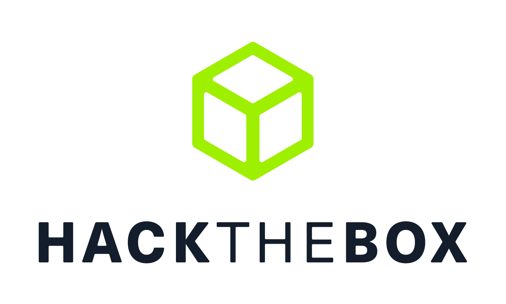

# Most importantly
สวัสดีครับ วันนี้ผมจะมาสรุปใจความสำคัญใน Module ที่ชื่อว่า Getting Started ของ HackTheBox Academy นะครับ โดยใน Module ดังกล่าวจะใช้เวลาอยู่ที่ประมาณ 8 ชั่วโมง (ตามที่เขาบอก 5555+) แต่สรุปแล้ว ซัดไป 2 วันตึง ๆ เพราะผมพยายามทำความเข้าใจให้มากขึ้น และต้องใช้ chatgpt ในส่วนที่ยังไม่ค่อยเข้าใจบ้างครับ

# Information Security Overview

จากหัวข้อแปลว่า "การรักษาความปลอดภัยข้อมูล" ซึ่งเป็นพื้นฐานของการปกป้องข้อมูลจากสิ่งต่าง ๆ ต่อไปนี้
1. จากการเข้าถึงโดยไม่ได้รับอนุญาต
2. การถูกเปลี่ยนแปลงข้อมูล
3. การเอาไปใช้งานที่ผิดกฎหมาย
4. และอื่น ๆ

เราต้องคงไว้ซึ่ง **CIA Triad (รูปด้านบน)** ซึ่งมีความหมายว่า
1. Confidentiality : การรักษาความลับ
    * เพื่อนร่วมงานไม่ควรมาชะเง้อดู Computer ของเราว่าคุยกับใคร
    * เอกสารลับของทางราชการ ควรมีการกำหนดคนที่สามารถเข้าถึงได้เพียงบางคน

2. Integrity : การรักษาความถูกต้องของข้อมูล
    * ถูกสับเปลี่ยนข้อมูล
    * ถูกแก้ไขหน้าเว็บไซต์
    * ถูกเปลี่ยนชื่อผู้รับ หรือ ผู้ส่งเอกสาร

3. Availability : ความพร้อมใช้งานอยู่เสมอ
    * ถูก DDOS ทำให้เว็บล่ม
    * แอปพลิเคชันธนาคารเปิดไม่ได้เวลาเงินเดือนออก
    * เว็บมหาวิทยาลัยเปิดไม่ได้เวลาจะประกาศผลสอบ
    * เจ้าหน้าที่จะใช้งานระบบภายในองค์กร แต่ไม่สามารถทำงานได้

# Risk Management Process
จากหัวข้อแปลว่า "กระบวนการจัดการความเสี่ยง" เป็นการทำนโยบายไปใช้ โดยไม่ส่งผลด้านลบต่อองค์กร ซึ่ง **Risk Management Process จะมี 5 กระบวนการ**
1. **Identify** : ระบุความเสี่ยงที่จะต้องเผชิญ
2. **Analyze** : วิเคราะห์ความเสี่ยงเพื่อ **พิจารณาผลกระทบ** โดยที่ **ทุก ๆ ความเสี่ยงจะต้องมีนโยบาย ขั้นตอน และกระบวนการสำหรับธุรกิจต่าง ๆ**
3. **Evaluate** : ประเมินความเสี่ยง **เพื่อจัดลำดับความสำคัญของความเสี่ยง** เพื่อตัดสินใจว่า จะยอมรับเพราะเลี่ยงไม่ได้, หลีกเลี่ยง, ควบคุม หรือ โอนความเสี่ยงไปเลย
4. **Dealing** : กำจัดความเสี่ยงให้ได้มากที่สุด
5. **Monitoring** : ทุก ๆ ความเสี่ยงต้องมีการติดตามอย่างต่อเนื่อง เพื่อดูว่ามีการเปลี่ยนแปลงที่ส่งผลต่อคะแนน Impact หรือไม่